# dotfiles

Configurazione di [AeroSpace](https://github.com/nikitabobko/AeroSpace) (tiling window manager) e
[SketchyBar](https://github.com/FelixKratz/SketchyBar) (barra di stato), con i bordi delle finestre
disegnati da [JankyBorders](https://github.com/FelixKratz/JankyBorders).

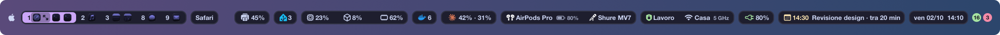

```
dotfiles/
├── Brewfile                   (i pacchetti Homebrew)
├── aerospace/aerospace.toml   → ~/.config/aerospace
├── sketchybar/                → ~/.config/sketchybar
│   ├── sketchybarrc
│   ├── start.sh               (avvia SketchyBar e lo riavvia quando si chiude)
│   ├── colors.sh              (la palette, condivisa da sketchybarrc e dai plugin)
│   ├── notification_apps.conf (le app di cui contare le notifiche)
│   ├── home_assistant.conf.example  (da copiare in home_assistant.conf, che non è nel repo)
│   ├── plugins/*.sh
│   └── helpers/*.swift, *.plist, *.js  (compilati o eseguiti da sketchybarrc)
└── screenshots/               (le immagini di questo README, con dati inventati)
    ├── take.sh                (le rifà, vedi Screenshot in fondo)
    └── mock/                  (gli helper e i comandi finti che usano i plugin)
```

Le cartelle in `~/.config` sono symlink verso questo repo: le app leggono la config dal percorso
standard, ma i file veri stanno qui.

## Setup su un Mac nuovo

### 1. Homebrew

```bash
/bin/bash -c "$(curl -fsSL https://raw.githubusercontent.com/Homebrew/install/HEAD/install.sh)"
```

Alla fine segui le istruzioni che stampa per aggiungere `brew` al `PATH` (su Apple Silicon è in
`/opt/homebrew/bin`). L'installer porta con sé anche i Command Line Tools, quindi `git` e
`swiftc`.

### 2. Pacchetti

```bash
brew install --cask nikitabobko/tap/aerospace
brew tap FelixKratz/formulae
brew install sketchybar borders terminal-notifier
brew install --cask font-sf-pro
```

I testi della barra usano Helvetica Neue, già presente su macOS. Le icone di rete e audio sono
[SF Symbols](https://developer.apple.com/sf-symbols/) e servono il font SF Pro: il cask è un
installer `.pkg`, quindi chiede la password di amministratore. Senza SF Pro le icone appaiono come
riquadri vuoti.

Gli stessi pacchetti sono elencati nel `Brewfile`: SketchyBar mostra gli aggiornamenti solo di
quelli, quindi se ne aggiungi uno aggiungilo anche lì.

### 3. Clona il repo

```bash
mkdir -p ~/Developer
git clone https://github.com/Francesco-Rapetti/dotfiles.git ~/Developer/dotfiles
```

Il percorso è a tua scelta, ma i comandi sotto assumono `~/Developer/dotfiles`.

### 4. Symlink

```bash
mkdir -p ~/.config
ln -s ~/Developer/dotfiles/aerospace ~/.config/aerospace
ln -s ~/Developer/dotfiles/sketchybar ~/.config/sketchybar
```

Attenzione:

- Se `~/.config/aerospace` o `~/.config/sketchybar` esistono già come cartelle, rinominale prima
  (es. `mv ~/.config/sketchybar ~/.config/sketchybar.bak`): altrimenti `ln -s` crea il link
  *dentro* la cartella esistente invece di sostituirla.
- Non deve esistere `~/.aerospace.toml`: se AeroSpace trova due config si rifiuta di caricarle.
- Collega sempre le cartelle, non i singoli file: molti editor salvano riscrivendo il file e
  romperebbero un symlink al file.

### 5. Impostazioni di macOS

Queste sono le impostazioni che uso insieme ad AeroSpace e SketchyBar:

| Impostazione | Valore | Perché |
| --- | --- | --- |
| Barra dei menu → nascondi automaticamente | Sempre | Al suo posto c'è SketchyBar |
| Barra dei menu a schermo intero | Nascosta | Idem |
| Scrivania e Dock → riorganizza gli spazi in base all'uso recente | Off | Non rimescola gli spazi di macOS |
| Scrivania e Dock → clic sullo sfondo per mostrare la scrivania | Solo in Stage Manager | Evita che un clic tra le finestre le sposti tutte |
| Scrivania e Dock → trascina le finestre sul bordo per affiancarle | Off | Il tiling nativo si scontra con AeroSpace |

Da terminale:

```bash
defaults write NSGlobalDomain _HIHideMenuBar -bool true
defaults write NSGlobalDomain AppleMenuBarVisibleInFullscreen -bool false
defaults write com.apple.dock mru-spaces -bool false
defaults write com.apple.WindowManager EnableStandardClickToShowDesktop -bool false
defaults write com.apple.WindowManager EnableTilingByEdgeDrag -bool false
killall Dock
```

La barra dei menu potrebbe richiedere un logout per nascondersi.

### 6. Avvia AeroSpace

```bash
open -a AeroSpace
```

- Al primo avvio concedi il permesso di **Accessibilità** (Impostazioni di Sistema → Privacy e
  sicurezza → Accessibilità → AeroSpace).
- AeroSpace si avvia da solo al login (`start-at-login = true`) e a sua volta lancia `borders` e
  `sketchybar/start.sh` (`after-startup-command` in `aerospace.toml`), che avvia `sketchybar` e lo
  riavvia ogni volta che si chiude, per esempio dopo un crash. **Non** attivare
  `brew services start sketchybar` o `borders`: partirebbero due istanze, e i plugin di SketchyBar
  girerebbero con un altro `PATH`. Per chiudere SketchyBar davvero ferma prima `start.sh`:
  `pkill -f sketchybar/start.sh; pkill -x sketchybar`.

### 7. Verifica

```bash
aerospace config --config-path
```

Deve stampare `~/.config/aerospace/aerospace.toml`. In alto dovresti vedere la barra con il logo
Apple, i workspace, l'app attiva, il logo di Home Assistant, l'uso di CPU, GPU e memoria, Docker (se è in esecuzione), l'uso di Claude, l'uscita e l'ingresso audio, la rete (con la
VPN, se attiva), la batteria, il prossimo evento del calendario, l'orologio e, se ci sono notifiche
o aggiornamenti, i loro pallini all'estrema destra, e la finestra attiva con il bordo sfumato.

La barra è trasparente: ogni elemento, tranne il logo Apple, ha uno sfondo suo, un rettangolo
arrotondato che galleggia sopra la scrivania, allineato ai bordi delle finestre. Quelli fatti di più parti ne hanno uno solo:
i workspace, CPU/GPU/memoria, l'audio, la rete e il calendario. I colori sono la palette
[Catppuccin Mocha](https://catppuccin.com/palette/#flavor-mocha), con il mauve (`#cba6f7`) come
colore principale: il workspace attivo, oggi nel calendario, le voci dei popup che fanno qualcosa,
gli slider e le barre. Sono tutti in `sketchybar/colors.sh`: per cambiare il colore principale basta
cambiare `PRIMARY`.

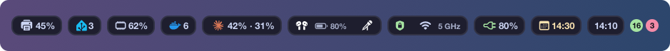

Sul display del MacBook il notch copre il centro della barra, e gli elementi di destra finirebbero
sotto. Lì CPU e GPU spariscono e resta solo la memoria; dell'audio, della rete e della VPN restano
le icone, con la batteria dei dispositivi e la banda del Wi-Fi; del calendario solo l'orario del
prossimo evento, colorato secondo quanto manca (vedi sotto), e dell'orologio solo l'ora. Un clic
apre gli stessi popup. Gli altri monitor mostrano tutto, con i nomi interi.
`plugins/notch.sh` riconosce i display con il notch e sposta gli elementi quando colleghi o
scolleghi un monitor; quali elementi spariscono lo decide la sua lista `ITEMS`.

Se la barra è vuota o mancano i workspace:

```bash
chmod +x ~/Developer/dotfiles/sketchybar/sketchybarrc ~/Developer/dotfiles/sketchybar/plugins/*.sh
sketchybar --reload
```

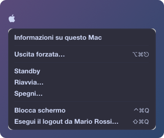

Il logo Apple sostituisce quello della barra dei menu, che SketchyBar copre: un clic apre gli stessi
comandi, con i testi di macOS (*Informazioni su questo Mac*, *Impostazioni di Sistema…*,
*App Store…*, *Elementi recenti*, *Uscita forzata…*, *Standby*, *Riavvia…*, *Spegni…*,
*Blocca schermo*, *Esegui il logout da …*) e le loro scorciatoie. Fanno quello che fa il menu vero:
riavvio, spegnimento e logout chiedono conferma con la finestra di macOS, che li esegue da sola dopo
un minuto. Accanto a Impostazioni di Sistema e all'App Store c'è il numero degli avvisi e degli
aggiornamenti, lo stesso del Dock, e con aggiornamenti l'App Store si apre su quelli. *Elementi
recenti* si apre dentro il menu, sotto la sua riga, con le app, i documenti e i server recenti e
*Cancella menu*: un sottomenu accanto si chiuderebbe appena ci porti sopra il mouse. macOS non ha un
comando da terminale per gli elementi recenti e per bloccare lo schermo, quindi `sketchybarrc`
compila `helpers/apple_menu.swift` (non è nel repo). La prima volta che usi *Uscita forzata…*,
*Riavvia…*, *Spegni…* o il logout macOS potrebbe chiedere di consentire a SketchyBar di controllare
loginwindow: scegli *Consenti*.

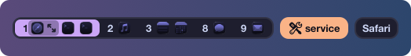

Ogni workspace mostra il numero seguito dall'icona di ciascuna delle sue finestre, la stessa del
Dock: tre finestre di VS Code sono tre icone. Quello attivo è evidenziato insieme alle sue icone, e
quelli vuoti non compaiono; la finestra attiva ha un riquadro più scuro dietro la sua icona, e quella
a tutto schermo con `alt-f` ha dopo l'icona le due frecce del fullscreen. Un clic sul numero apre il
workspace, un clic su un'icona porta a quella finestra. Le app senza bundle id mostrano l'iniziale
del nome. Le icone si aggiornano quando una finestra si apre, si chiude o cambia workspace: per
questo `aerospace.toml` avvisa SketchyBar a ogni cambio di focus (`on-focus-changed`), con
`alt-shift-1` … `alt-shift-9` e con `alt-f`, che non sposta il focus.

Quando AeroSpace non è nella mode `main`, ad esempio nella `service` che apre `alt-shift-;`, dopo i
workspace compare una pillola arancione con il nome della mode; un clic su questa torna a `main`.
AeroSpace non ha un callback per i cambi di mode, quindi `sketchybarrc` avvia
`plugins/aerospace.sh watch`, che li segue con `aerospace subscribe mode-changed`.

Le icone seguono l'ordine delle finestre sullo schermo, da sinistra a destra e, in una colonna,
dall'alto in basso; spostando una finestra con `alt-shift-a/s/w/d` si spostano anche loro.
AeroSpace elenca le finestre per nome dell'app e non dice il loro ordine, quindi `sketchybarrc`
compila `helpers/window_order.swift` (non è nel repo), che lo legge da macOS. Le finestre dei
workspace nascosti stanno tutte in un angolo dello schermo: per questi vale l'ordine dell'ultima
volta che erano visibili, e dopo un riavvio del Mac quello alfabetico finché non li apri. Negli
accordion con più di tre finestre quelle in mezzo hanno la stessa posizione, quindi il loro ordine
può non essere quello di AeroSpace.

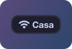

La rete mostra il nome del Wi-Fi, `Ethernet` quando c'è un cavo, `Non connesso` (giallo) o
`Wi-Fi off` (rosso). Dopo il nome del Wi-Fi, più piccola e grigia, c'è la banda: `2,4 GHz`,
`5 GHz` o `6 GHz`; sul MacBook c'è solo l'icona, diversa per ciascuno stato, con la banda. Da
macOS 14.4 il nome del Wi-Fi è oscurato in `networksetup`, `ipconfig` e
`system_profiler`: `plugins/network.sh` lo legge dall'ultima scansione salvata nella configurazione
di sistema, che ha anche il canale e quindi la banda. Se un aggiornamento di macOS chiude anche questa strada, al posto del nome compare
`Wi-Fi`. Con una VPN attiva, nella stessa pillola, prima della rete come in macOS, compaiono uno
scudo verde e il suo nome: quello delle VPN di Impostazioni di Sistema e delle app VPN (WireGuard,
Tailscale…), che macOS elenca in `scutil --nc list`, oppure `VPN` per quelle che macOS non conosce
ma che si vedono dal loro tunnel (`utun`); sul MacBook c'è solo lo scudo. La barra si aggiorna
subito quando cambia la connessione principale e comunque ogni 30 secondi: la VPN può comparire o
sparire con quel ritardo.
Un clic sulla rete o sulla VPN apre l'indirizzo IP del Mac, quello pubblico, il router e la VPN, con
il suo indirizzo. L'IP pubblico lo chiede a [ipify](https://www.ipify.org) a ogni apertura del popup:
con la VPN è quello della VPN. Finché non arriva quello nuovo resta il precedente, in grigio se nel
frattempo la connessione è cambiata.
Sotto ci sono l'Ethernet e il Wi-Fi, ciascuno con *Disattiva* o *Attiva*. Per l'Ethernet è
*Disattiva servizio* di Impostazioni di Sistema → Rete (`networksetup -setnetworkserviceenabled`,
che resta anche dopo un riavvio), con l'adattatore e se è connesso; compare solo quando c'è
l'adattatore. Per il Wi-Fi è l'interruttore del Wi-Fi.
Poi le reti Wi-Fi vicine, con il segnale a una, due o tre tacche e il lucchetto se sono protette:
prima quelle salvate sul Mac, con quella in uso evidenziata, poi le altre, le dieci più forti.
Un clic su una si collega, e intanto la riga dice *Connessione…*. Da macOS 14.4 i nomi delle reti li
vede solo un'app che può usare la posizione, e `networksetup -setairportnetwork` non si collega più
(errore -3900). Per questo `sketchybarrc` compila `helpers/wifi_networks.swift` in una piccola app,
`helpers/wifi_networks.app` (non è nel repo), come per il calendario. L'app resta aperta, perché
macOS le dà il permesso qualche secondo dopo ogni avvio. Avvisa la barra quando cambiano le reti, e
quando si apre il popup ne cerca di nuove. Al primo avvio, e a volte dopo una ricompilazione
(l'app è firmata ad-hoc), macOS chiede l'accesso alla posizione per **SketchyBar Wi-Fi**: scegli
*Consenti*. Se l'hai negato, il popup mostra *Consenti la posizione per vedere le reti*, che apre
Impostazioni di Sistema → Privacy e sicurezza → Servizi di localizzazione.
Per collegarsi l'app deve dare la password anche per le reti già salvate. Per queste la prende dal
portachiavi di Sistema, e macOS la concede solo con nome e password di un amministratore, ogni volta;
le altre reti protette la chiedono in una finestra. La password che funziona finisce nel portachiavi
login (servizio `sketchybar-wifi`), dove `security` la legge senza chiedere niente, come il token di
Home Assistant: dalla volta dopo il cambio di rete è immediato. Le reti aziendali o universitarie,
che vogliono anche un nome utente, aprono Impostazioni Wi-Fi. Le icone del segnale le disegna
`helpers/network_icons.js` in `helpers/network_icons` (non è nel repo), dal simbolo SF del Wi-Fi.

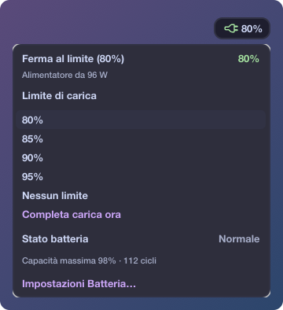

La batteria mostra la percentuale e, con l'icona, lo stato: a batteria il livello (giallo con il
risparmio energetico, altrimenti rosso dal 20% in giù), in carica il fulmine, collegato ma non in
carica la spina, gialla se macOS non dice perché. Il verde è la batteria di cui si sta occupando
macOS: il fulmine mentre carica fino al limite di carica, la spina quando tiene ferma la carica, al
limite, per il caricamento ottimizzato o nella *modalità desktop* di un Mac usato raramente a
batteria. Un clic apre lo stato a parole (`Ferma al limite (80%)`, `Carica sospesa`,
`Ancora 5 h 12 min`…) con la potenza dell'alimentatore, poi il **limite di carica** di macOS
(Impostazioni di Sistema → Batteria, da macOS 26.4): un clic su 80, 85, 90, 95% o *Nessun limite*
lo cambia, come in Impostazioni. Con il limite attivo c'è anche *Completa carica ora*, la stessa
voce del menu della batteria di macOS: carica fino al 100%, e più tardi il limite torna da solo.
Finché è sospeso il fulmine e la spina sono gialli e il popup lo dice accanto al titolo, con
evidenziato il limite a cui tornerà e, al posto di *Completa carica ora*, *Riattiva il limite ora*;
le percentuali restano grigie e non si cliccano finché non lo riattivi. macOS dice quel limite solo
a Impostazioni, quindi l'helper ricorda l'ultimo che ha visto attivo (in
`~/Library/Preferences/sketchybar.battery_charge.plist`); se non l'ha mai visto, nessuno è
evidenziato, manca *Riattiva il limite ora* e un clic su una percentuale riattiva il limite con
quella. In fondo lo stato della batteria (capacità massima e
cicli, come in Impostazioni) e *Impostazioni Batteria…*.
È il modo per tenere il Mac sempre collegato, per esempio chiuso con un monitor esterno, senza
stressare la batteria e senza app come AlDente: il limite lo applica macOS, solo mentre è acceso
(da spento la carica la gestisce il firmware), e ogni tanto carica comunque fino al 100% per tarare
la batteria. 80% è il limite più basso che macOS permette.
macOS non ha un comando da terminale per il limite (`pmset -g battlimit` lo mostra soltanto), quindi
`sketchybarrc` compila `helpers/battery_charge.swift` (non è nel repo), che lo legge e lo cambia con
il framework privato che usa Impostazioni di Sistema e resta in ascolto per aggiornare la barra
appena cambia la batteria o il limite, anche da Impostazioni. macOS registra che l'helper non ha
l'autorizzazione (*entitlement*) di Impostazioni, ma risponde lo stesso; se un aggiornamento di
macOS lo impedisse, il limite resterebbe modificabile solo da Impostazioni. La spina è un simbolo SF
che `helpers/battery_icons.js` disegna in `helpers/battery_icons` (non è nel repo), un'immagine per
colore.

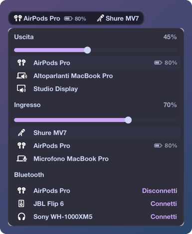

L'audio mostra il dispositivo di uscita e quello di ingresso predefiniti, con un'icona per tipo
(altoparlanti, cuffie, headset, AirPods, Galaxy Buds4 Pro, occhiali audio, monitor, AirPlay,
microfono); il Mac, gli schermi e gli occhiali audio, che per uscita e ingresso avrebbero lo stesso
simbolo, hanno il loro con un altoparlante o un microfono. Se sono lo stesso dispositivo, per
esempio cuffie Bluetooth, compare solo quello di uscita, e se ha i due simboli con l'altoparlante e
il microfono affiancati. Lo stesso vale per altoparlanti e microfono del Mac, che diventano il Mac
stesso, con il suo nome: per esempio `MacBook Pro`, la parte comune a `Altoparlanti MacBook Pro` e
`Microfono MacBook Pro`. Sul MacBook ci sono solo le icone, con la batteria. Dopo il nome dei
dispositivi Bluetooth c'è la batteria, se macOS la
conosce: un'icona col livello (rossa dal 20% in giù) e la percentuale, più piccole e grigie del nome
e aggiornate ogni due minuti. Per gli auricolari conta il lato più scarico.
Le icone sono simboli SF, tranne quelle che SF Symbols non ha, immagini che `sketchybarrc` genera
quando cambia lo script che le fa. Quelle del Mac, degli schermi e degli occhiali le disegna
`helpers/audio_icons.js` in `helpers/audio_icons`, dai simboli del dispositivo e dell'altoparlante o
del microfono. Disegna come immagini anche gli altri simboli, per il menu: una sua riga può avere
l'icona, il nome e il testo a destra solo se l'icona è un'immagine. Quella delle Galaxy Buds (riconosciute da `Buds4 Pro` nel nome) la ricava
`helpers/galaxy_buds_icon.js` da una foto su sfondo trasparente, ritagliata e schiarita perché il
corpo nero non sparisca sulla barra scura. La foto è di Samsung, quindi né lei né l'icona sono nel
repo: la foto va messa in `sketchybar/helpers/galaxy_buds_photo.png`, altrimenti le Buds hanno
l'icona delle cuffie.
Un clic sull'uscita o sull'ingresso apre il volume e i dispositivi di entrambi: per ciascuno il
volume in percentuale, uno slider che lo cambia quando lo rilasci e i dispositivi che elencano le
Impostazioni di Sistema (senza quelli delle app, come Microsoft Teams Audio), con quello in uso
evidenziato e la batteria di quelli Bluetooth, come nella barra. Un clic su un altro lo rende
quello predefinito; gli avvisi e gli effetti sonori passano alla nuova uscita, a meno che non li
avessi mandati su un altro dispositivo. Se macOS non può cambiare il volume, come per le Arctis Nova
Pro Wireless, che lo regolano dalla base, o per gli schermi, al posto dello slider c'è *Volume
regolabile solo dal dispositivo*. Lo slider segue anche i tasti del volume, a zero quando l'audio è
muto, e alzarlo toglie il muto.
In fondo ci sono i dispositivi audio Bluetooth abbinati al Mac, anche quelli spenti: un clic li
connette (*Connetti*) o li disconnette (*Disconnetti*). Finché ci prova la riga è gialla; se il
dispositivo è spento o lontano, dopo una quindicina di secondi compare *Non riuscito*. macOS
permette di usare il Bluetooth solo all'app che lo chiede, quindi `sketchybarrc` compila
`helpers/bluetooth_devices.swift` in una piccola app, `helpers/bluetooth_devices.app` (non è nel
repo), come per il calendario. Al primo clic macOS chiede l'accesso al Bluetooth per **SketchyBar
Bluetooth**: scegli *Consenti*. Se l'hai negato compare *Non consentito*: attiva SketchyBar Bluetooth
in Impostazioni di Sistema → Privacy e sicurezza → Bluetooth.
macOS non ha un comando da terminale per leggerli e cambiarli, quindi `sketchybarrc` compila
`helpers/audio_devices.swift` al primo avvio (e ogni volta che il sorgente cambia) e lo lascia in
ascolto per aggiornare la barra appena cambi dispositivo o volume. Il binario compilato non è nel
repo. Se l'audio non compare, compilalo a mano per vedere l'errore:

```bash
swiftc -O ~/Developer/dotfiles/sketchybar/helpers/audio_devices.swift -o ~/Developer/dotfiles/sketchybar/helpers/audio_devices
```

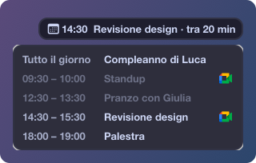

Il calendario mostra il prossimo evento della giornata e quanto manca
(`14:30  Riunione · tra 20 min`, oppure `tra 1 h 20 min`). L'icona e l'orario cambiano colore man
mano che l'evento si avvicina: bianchi, gialli da 30 minuti prima, arancioni da 15 e rossi da 5
(le soglie sono in cima a `plugins/calendar.sh`). Mentre un evento è in corso mostra quello e quanto
manca alla fine (`14:30  Riunione · fino alle 15:00 (ancora 20 min)`), con l'orario in viola come
nel popup, a meno che il successivo non inizi prima che finisca. Sul MacBook c'è solo l'orario.
Quando non restano eventi con orario compaiono quelli di tutto il giorno, e se non ci sono neanche
quelli l'elemento sparisce. Legge tutti i calendari dell'app Calendario, tranne gli eventi
annullati o rifiutati.
Un clic apre gli eventi della giornata, prima quelli di tutto il giorno, con quelli passati in
grigio e l'orario di quello in corso in viola. Gli eventi con una riunione di Google Meet hanno il
logo di Meet, e un clic li fa entrare nella riunione; un clic sugli altri li apre in Calendario. Il
link di Meet lo cerca nelle note dell'evento, dove lo scrive Google Calendar, nel luogo e nell'URL.
Il logo è quello di [MeetingBar](https://meetingbar.app), che `helpers/meet_icon.js` disegna in
`helpers/meet_icon.png`; è di Google, quindi non è nel repo, e senza MeetingBar al suo posto c'è
una videocamera verde.
macOS concede l'accesso al calendario solo all'app che lo chiede, quindi `sketchybarrc` compila
`helpers/calendar_events.swift` in una piccola app senza icona nel Dock,
`helpers/calendar_events.app` (non è nel repo), e la avvia con `open`. Al primo avvio macOS chiede
l'accesso ai calendari per **SketchyBar Calendar**: scegli *Consenti* (lo richiede ogni volta che
`calendar_events.swift` cambia, perché l'app ricompilata ha un'altra firma).
Se l'hai negato, al posto dell'evento compare `Nessun accesso al calendario` in rosso: attiva
SketchyBar Calendar in Impostazioni di Sistema → Privacy e sicurezza → Calendari, poi
`sketchybar --reload`.

I testi seguono la lingua del Mac (italiano o inglese, per le altre lingue inglese) e gli orari il
formato della sua regione, 12 o 24 ore compreso. Anche l'orologio mostra il giorno della settimana
nella lingua del Mac (`mer 30/09  14:30`); sul MacBook solo l'ora.

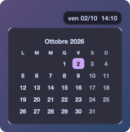

Un clic sull'orologio apre il mese corrente, con oggi evidenziato, la settimana che parte dal
giorno scelto in Impostazioni di Sistema → Generali → Lingua e Zona e i weekend più tenui; un clic
sul mese apre Calendario. SketchyBar non sa disporre gli elementi di un popup in una griglia, quindi
il mese è un'immagine che `helpers/calendar_month.swift` disegna ogni volta che si apre, con i pixel
del monitor su cui si apre (compilato da `sketchybarrc`, non è nel repo).

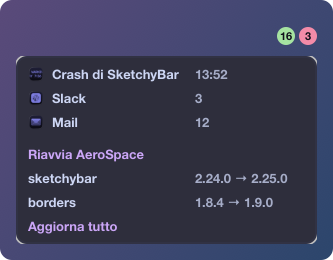

All'estrema destra ci sono le notifiche, due pallini che compaiono solo quando hanno qualcosa da
contare: uno verde per le notifiche da leggere delle app scelte e per i crash di SketchyBar, e uno
rosso per gli aggiornamenti di Homebrew. Un clic su uno dei due apre lo stesso elenco: prima i
crash, poi le app, poi i pacchetti.

Il pallino verde somma i badge che le app di `sketchybar/notification_apps.conf` hanno sulla loro
icona nel Dock, per esempio i messaggi non letti di Slack: si aggiorna entro 2 secondi e sparisce
quando li leggi nell'app. Un badge senza numero, come il punto di Slack per i canali non letti,
conta uno. Nell'elenco ogni app ha la sua icona e il suo badge, e un clic la apre. Nel file c'è
un'app per riga, con il suo bundle id (`osascript -e 'id of app "Nome App"'`) o il nome; le
modifiche valgono subito, senza ricaricare la barra. macOS non avvisa quando cambia un badge, quindi
`sketchybarrc` avvia `plugins/notification.sh watch`, che li legge con `lsappinfo` ogni 2 secondi e
aggiorna la barra quando cambiano. Le app chiuse non hanno badge, e un'app che non ne mette
nessuno sull'icona non si può seguire così: il testo delle notifiche è nel database del Centro
Notifiche, che macOS apre solo con l'Accesso completo al disco.

Il pallino verde conta anche i crash di SketchyBar. `sketchybar/start.sh`, che AeroSpace lancia al
posto di `sketchybar`, lo fa ripartire ogni volta che si chiude e, se si è chiuso per un crash,
scrive in `~/Library/Logs/sketchybar-crash.log` cosa dice il report di macOS: l'eccezione, le
versioni di SketchyBar e di macOS, lo stack del thread del crash e il percorso del report completo,
che si apre con Console. Il crash più recente è in cima. Nell'elenco compare *Crash di SketchyBar*
con l'ora dell'ultimo (o il giorno, se non era oggi): un clic apre il log in Console e il pallino
smette di contarli. Se SketchyBar si chiude meno di 10 secondi dopo essere partito, `start.sh`
aspetta 10 secondi prima di riavviarlo, così un crash all'avvio non lo fa ripartire di continuo.

Il pallino rosso compare quando uno dei pacchetti del `Brewfile` ha una nuova versione su Homebrew,
con quanti sono. Nell'elenco ognuno ha la versione installata e quella nuova (`1.8.4 → 1.9.0`), un
clic su un pacchetto lo aggiorna e, se sono più di uno, c'è anche *Aggiorna tutto*, che aggiorna
solo quelli dell'elenco: gli altri pacchetti di Homebrew restano com'erano, tranne le dipendenze di
cui una nuova versione ha bisogno. Durante l'aggiornamento il pallino diventa giallo e gli altri
clic sui pacchetti vengono ignorati. `plugins/notification.sh` esegue `brew update` ogni ora, al
risveglio e a ogni `sketchybar --reload`. Dopo l'aggiornamento riavvia `sketchybar`, che `start.sh`
fa ripartire da solo, e `borders`, con il suo comando di `after-startup-command` in
`aerospace.toml`, così usano subito la nuova versione. Se un aggiornamento non riesce compare una notifica, e un clic apre l'output di brew
(`~/Library/Logs/sketchybar-brew.log`). `font-sf-pro` ha versione `latest`, quindi Homebrew non lo
segnala mai come da aggiornare.

AeroSpace invece continua con la vecchia versione finché non si riavvia, e riavviarlo da solo in
mezzo al lavoro rimescolerebbe le finestre. Dopo averlo aggiornato compare una notifica: un clic
apre l'elenco, che prima dei pacchetti ha *Riavvia AeroSpace*, e il pallino rosso la conta finché
non lo riavvii. La riga c'è anche se hai aggiornato AeroSpace da terminale, perché
`aerospace --version` mostra sia la versione installata sia quella in esecuzione. Il riavvio
disattiva AeroSpace, che così rimette sullo schermo le finestre dei workspace nascosti, poi lo
chiude e lo riapre: ogni finestra finisce nel workspace visibile sul suo monitor, tranne le app con
una regola `on-window-detected`, che tornano nel loro. Le notifiche le manda `terminal-notifier`: alla prima macOS chiede il permesso, scegli
*Consenti*.

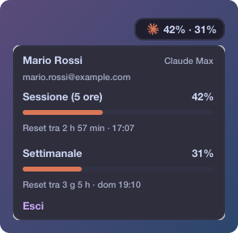

La scintilla arancione di Claude mostra quanto hai usato dei limiti del tuo piano, la sessione di
5 ore e la settimana (`50% · 39%`), in giallo dal 75% e in rosso dal 90%. Un clic apre il nome,
l'email e il piano dell'account e, per ciascun limite, la percentuale, una barra e quanto manca al
reset (`Reset tra 2 h 57 min · 01:10`). In fondo c'è *Esci*, che vuole un secondo clic prima di
scollegare l'account. Senza un account c'è solo *Accedi*: apre la pagina di accesso di Claude nel
browser e, finito l'accesso, l'elemento si aggiorna; se non riesce compare una notifica, e un clic
apre l'output di claude (`~/Library/Logs/sketchybar-claude.log`). I numeri sono quelli di `/usage`
di Claude Code: `plugins/claude.sh` li chiede a `claude -p` senza mandare messaggi, quindi senza
consumare crediti, ogni 5 minuti, al risveglio e a ogni clic (in alto a destra compare
*Aggiornamento…* finché non arrivano), e Claude Code rinnova da solo il login scaduto. Claude Code
chiede i numeri al server solo se quelli che ha sono più vecchi di un minuto. Se una lettura non riesce, per esempio senza rete, restano gli ultimi numeri in
grigio fino alla successiva. Serve [Claude Code](https://code.claude.com/docs) (lo cerca anche fuori dal
`PATH`: `~/.local/bin`, Homebrew, nvm) e `jq`, che macOS ha da Sequoia. L'icona è quella della
barra dei menu dell'app Claude, che `helpers/claude_icon.js` colora in `helpers/claude_icon.png`
(non è nel repo); senza l'app al suo posto c'è ✻.

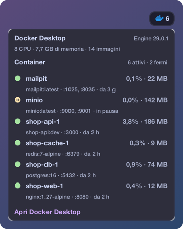

Alla sinistra di Claude, mentre Docker è in esecuzione, c'è la balena di Docker con quanti container
sono attivi, come in `docker ps` (quindi anche quelli in pausa): grigio quando non ce n'è nessuno,
rosso quando uno non supera l'health check o continua a riavviarsi. Quando Docker si ferma
l'elemento sparisce. Un clic apre il motore (Docker Desktop, la versione di Docker Engine, CPU,
memoria e immagini) e i container attivi in ordine di nome, così quelli di un progetto Compose
stanno insieme. Per ciascuno c'è un'icona per lo stato (verde in esecuzione, gialla in pausa o
mentre parte l'health check, rossa se l'health check fallisce o se si riavvia), la CPU e la memoria
che usa, l'immagine, le porte pubblicate e da quanto è attivo (`nginx:1.27-alpine · :8080 · da 2 h`).
Ne elenca dieci, gli altri li conta. CPU e memoria le misura `docker stats` quando apri il popup e
poi ogni pochi secondi finché resta aperto; ci mette un paio di secondi, e intanto restano quelle
dell'ultima volta. In fondo c'è *Apri Docker Desktop*, che apre la Dashboard.
La barra si aggiorna subito: `sketchybarrc` avvia `plugins/docker.sh watch`, che segue
`docker events` e avvisa SketchyBar quando un container parte, si ferma, va in pausa o cambia stato
dell'health check; mentre Docker è spento controlla ogni 5 secondi se è partito. Una raffica di
eventi, come quella di `docker compose up`, aggiorna la barra una volta sola, un secondo dopo
l'ultimo. Funziona anche con gli altri motori che usano il comando `docker` (colima, OrbStack…), che
cerca anche fuori dal `PATH`, dove lo mettono Docker Desktop, Homebrew e OrbStack. La balena è
quella di Docker Desktop, che `helpers/docker_icons.js` colora nel blu di Docker in
`helpers/docker_icons` insieme alle icone degli stati (simboli SF); è un marchio di Docker, quindi
non è nel repo, e senza Docker Desktop al suo posto c'è una scatola.

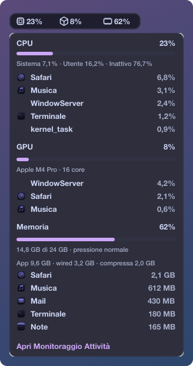

Alla sinistra di Docker, o di Claude quando Docker è spento, c'è quanto stanno lavorando la CPU, la GPU e la memoria, ognuna con la sua
icona (un chip, un cubo, un banco di RAM) e la percentuale, aggiornate ogni 2 secondi; sul MacBook
c'è solo la memoria. CPU e GPU diventano gialle dal 75% e rosse dal 90%. La memoria è la *Memoria utilizzata* di Monitoraggio
Attività (memoria delle app, wired e compressa) sul totale, e ha il colore della *Pressione
memoria*, come il suo grafico: macOS tiene la memoria quasi piena di cache e di pagine compresse,
quindi un 85% bianco è normale, mentre giallo e rosso vogliono dire che inizia a mancare.
Un clic su uno dei tre (o sulla memoria, sul MacBook) apre i dettagli di tutti e tre, aggiornati ogni 2 secondi finché il popup resta aperto: per
ciascuno una barra e le 5 app che lo usano di più, con la loro icona. I processi di un'app contano
insieme (per esempio tutti gli helper di Chrome) e quelli fuori da un'app, come WindowServer, hanno
il loro nome e nessuna icona. Per la CPU ci sono anche il tempo di sistema, utente e inattivo, e le
app sono in percentuale di tutta la CPU come la barra, mentre Monitoraggio Attività conta ogni core
come 100%. Per la GPU c'è il modello con i core, per la memoria i GB usati, lo swap, la pressione e
la divisione in app, wired e compressa. Nella lista della memoria ci sono solo i tuoi processi:
quanto ne usano quelli di sistema macOS lo dice solo con i permessi di amministratore. In fondo
c'è *Apri Monitoraggio Attività*.
macOS non ha un comando da terminale per l'uso della GPU, quindi `sketchybarrc` compila
`helpers/system_stats.swift` (non è nel repo), che legge i valori senza permessi di amministratore
e avvisa SketchyBar quando cambiano; i dettagli li legge solo mentre il popup è aperto. Se il
driver della GPU non ne riporta l'uso la GPU non compare; su Apple Silicon c'è sempre.

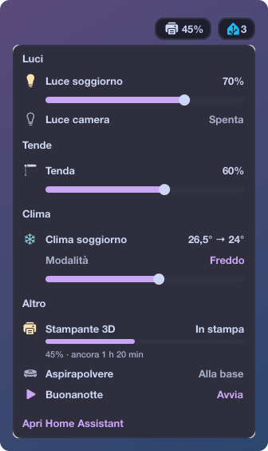

Alla sinistra della CPU c'è il logo di [Home Assistant](https://www.home-assistant.io), nel suo blu,
con quanti dispositivi del suo popup sono accesi (luci, prese, clima, l'aspirapolvere mentre
pulisce); è grigio quando Home Assistant non risponde. Mentre la stampante 3D stampa, alla sua sinistra compare una
stampante con la percentuale, gialla quando la stampa è in pausa.
Un clic su una delle due apre i dispositivi, divisi in gruppi, ognuno con il suo stato a destra. Un
clic accende o spegne le luci, le prese e il clima, apre o chiude le tende, manda l'aspirapolvere a
pulire o alla base, esegue uno script o una scena. Sotto le luci dimmerabili, le tende e il clima
acceso c'è uno slider che, quando lo rilasci, cambia la luminosità, la posizione o la temperatura,
con il passo del dispositivo; finché il condizionatore non risponde la riga mostra già il nuovo
valore. Il clima acceso ha anche la sua *Modalità*: un clic elenca le altre che ha (*Freddo*,
*Caldo*, *Deumidifica*, *Ventola*, *Caldo/freddo*, *Automatico*) e un clic su una la imposta. La
presa della stampante si spegne solo al secondo clic (*Fai clic per spegnere*), e lo fa con uno
script di Home Assistant che non fa niente mentre la stampante lavora; mentre stampa sotto la presa
c'è una barra con la percentuale e il tempo che manca (`45% · ancora 1 h 20 min`). In fondo c'è
*Apri Home Assistant*, che apre la dashboard.
L'indirizzo del server, la dashboard, i dispositivi con i loro nomi e la stampante (integrazione
Bambu Lab, facoltativa) sono in `sketchybar/home_assistant.conf`, che non è nel repo perché sono
quelli di casa: copia `sketchybar/home_assistant.conf.example`, che spiega cosa ci va, compilalo e
ricarica SketchyBar. Senza il file il logo non compare. Per un interruttore usa l'entità che lo
comanda: alcune integrazioni ne creano anche una che ne copia solo lo stato, e un clic su quella
non fa niente.
Lo stato arriva in tempo reale: `sketchybarrc` compila `helpers/home_assistant.swift` (non è nel
repo), che resta collegato alla WebSocket API di Home Assistant, avvisa SketchyBar quando cambia un
dispositivo e chiama i servizi per i clic. Se il server non risponde riprova ogni 10 secondi, e
subito al risveglio del Mac. Le icone sono simboli SF che `helpers/home_assistant_icons.js` disegna
in `helpers/home_assistant_icons` (non è nel repo), un'immagine per colore. Lo stesso script colora il
logo, che è un marchio di Home Assistant e quindi non è nel repo: `sketchybarrc` lo scarica una volta
dal tuo server, che lo ha come icona delle schede fissate di Safari, in
`helpers/home_assistant_logo.svg`. Se al primo avvio il server non risponde, al posto del logo c'è
una casa fino al prossimo `sketchybar --reload`.
Serve un token di accesso a lunga durata (Home Assistant → Profilo → Sicurezza → *Token di accesso
a lunga durata*), che sta nel Portachiavi e non nel repo. Copialo negli appunti, poi:

```bash
security add-generic-password -U -a "$USER" -s sketchybar-home-assistant -w "$(pbpaste)"
pbcopy < /dev/null
```

Non usare `-w` senza valore: il prompt prende al massimo 128 caratteri e taglierebbe il token. Per
verificarlo, con il server di `home_assistant.conf`, deve stampare `{"message":"API running."}`:

```bash
(source ~/.config/sketchybar/home_assistant.conf && curl -s -H "Authorization: Bearer $(security find-generic-password -s sketchybar-home-assistant -w)" "$SERVER/api/")
```

## Da adattare al nuovo Mac

In `aerospace/aerospace.toml`:

- **`gaps.outer.top`**: `40` = altezza di SketchyBar (32) + 8. Il display integrato ha `2` perché
  sui MacBook con notch macOS riserva già lo spazio in alto. Su un Mac senza notch usa `40` anche
  per il display integrato.
- **`[workspace-to-monitor-force-assignment]`**: il workspace 1 va sul monitor principale, il 2 sul
  secondario.
- **`[[on-window-detected]]`**: regole che spostano le app nei workspace (WhatsApp, Telegram, Mail
  → 9; Teams, Slack → 8; Spotify, Chrome → 2). Per trovare l'id di un'app:
  `osascript -e 'id of app "Nome App"'`.

Per Home Assistant, `sketchybar/home_assistant.conf` e il token nel Portachiavi non sono nel repo:
vanno rifatti su ogni Mac (vedi sopra, dopo CPU, GPU e memoria).

## Scorciatoie principali

| Tasti | Azione |
| --- | --- |
| `alt-1` … `alt-9` | Vai al workspace |
| `alt-shift-1` … `alt-shift-9` | Sposta la finestra nel workspace |
| `alt-a/s/w/d` | Focus sinistra/giù/su/destra |
| `alt-shift-a/s/w/d` | Sposta la finestra |
| `alt-shift-h/j/k/l` | Unisci con la finestra a sinistra/giù/su/destra |
| `alt-/` · `alt-,` | Layout tiles · accordion |
| `alt--` · `alt-=` | Ridimensiona |
| `alt-tab` | Workspace precedente |
| `alt-shift-tab` | Sposta il workspace sul monitor successivo |
| `alt-enter` | Apri Terminal |
| `alt-f` | Fullscreen |
| `alt-shift-space` | Finestra floating/tiling |
| `alt-backspace` | Chiudi la finestra |
| `alt-shift-;` | Modalità *service* (`esc` ricarica la config, `r` resetta il layout, `f` floating, `backspace` chiude le altre finestre, `↑`/`↓` volume) |

## Modificare la config

Modifica i file in `~/Developer/dotfiles` (o tramite i symlink in `~/.config`), poi ricarica:

```bash
aerospace reload-config
sketchybar --reload
```

Infine `git commit` e `git push` come in qualsiasi repo.

## Screenshot

Le immagini del README sono in `screenshots/` e le fa `screenshots/take.sh` con dati inventati:
fa girare i plugin come li fa girare SketchyBar, sulla barra vera, ma con gli helper e i comandi di
`screenshots/mock` (account, dispositivi, eventi, Wi-Fi, container, badge delle app, un crash e Home Assistant finti), e cattura solo le
finestre di SketchyBar, quindi niente scrivania né finestre sotto i popup. Per qualche secondo la
barra mostra quei dati e apre i popup uno alla volta, poi `sketchybar --reload` la rimette com'era.

```bash
~/Developer/dotfiles/screenshots/take.sh          # tutte
~/Developer/dotfiles/screenshots/take.sh battery  # solo quelle nominate
```

La prima volta macOS chiede il permesso di **Registrazione schermo** per il terminale (Impostazioni di
Sistema → Privacy e sicurezza → Registrazione schermo e audio di sistema). La barra e i popup
vengono dallo schermo dove c'è il mouse, e le immagini hanno i pixel di quello schermo: 2 per punto
su uno Retina. Con un monitor esterno, tieni il mouse su quello più largo: sul MacBook i due lati della
barra si sovrappongono.
Quando aggiungi o modifichi un plugin, aggiungi i suoi dati in `screenshots/mock` o in `take.sh`,
rifai le sue immagini e mettile nel README accanto alla sua descrizione.
